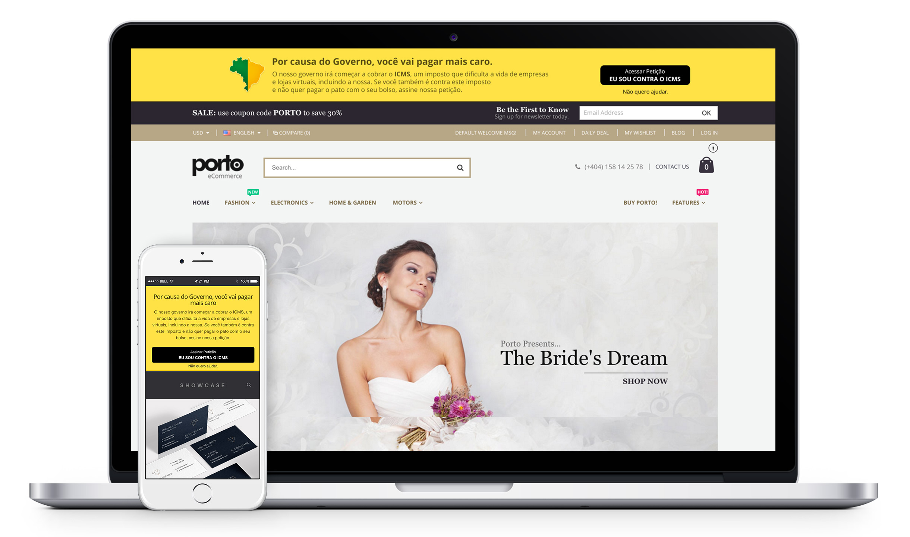

# Banner Contra ICMS



## Como Utilizar

Copie o código abaixo e cole na página da sua loja virtual ou site.

```html
<script async src="https://cdn.rawgit.com/kazzkiq/Banner-Contra-ICMS/master/icms-banner.js"></script>
```

O código criará um banner responsivo no topo da sua página como na imagem acima.

## Como Funciona

O código irá gerar uma barra amarela que permite o usuário assinar a petição, ou fechar o banner. Qualquer um dos botões, quando clicados, fecham o banner e não voltam a aparecer no navegador do usuário (a não ser que ele limpe os dados do navegador ou mude de computador).

## Estilizando o Banner

Caso o banner apresente algum problema no seu layout, você pode estilizá-lo criando seu próprio CSS. A estrutura CSS do banner é a seguinte:

```css
.icms--banner, .icms--banner * {
  box-sizing: border-box;
}

.icms--banner {
  /* Corpo do banner, parte amarela */
}

.icms--banner__container {
  /* Espaço onde o conteúdo fica */
}

.icms--banner__container img {
  /* Estilo da imagem lateral */
}

.icms--banner__container h2 {
  /* Estilo do título */
}

.icms--banner__container p {
  /* Estilo do texto */
}

.icms--banner__container a {
  /* Estilo do botão da Petição */
}

.icms--banner__cancel{
  /* Estilo do botão de fechar o banner */
}
```